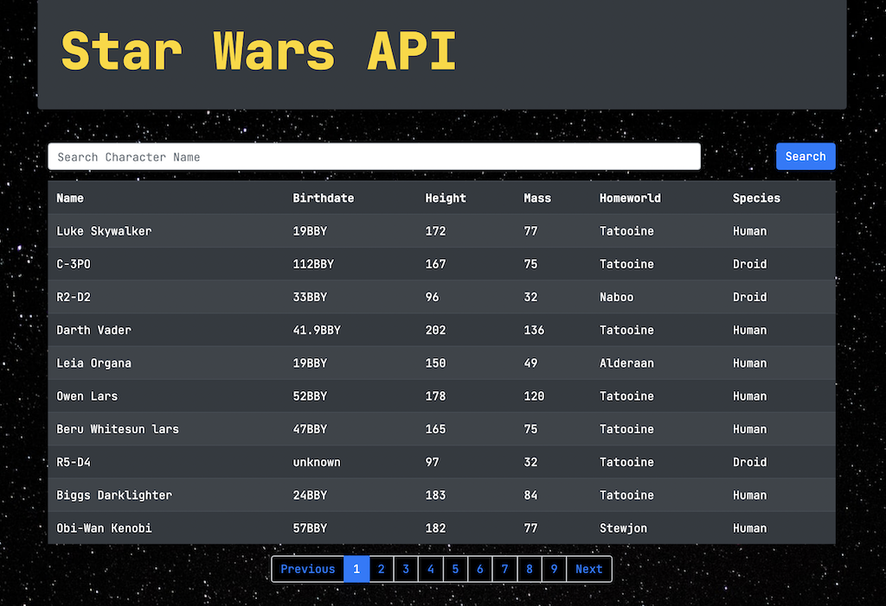

# Star Wars API

### Star Wars API made with React and Bootstrap

### See it [here](https://damp-castle-81042.herokuapp.com/)

## Summary

My second projst using React, this time practicing making HTTP requests to a Star Wars API. Adding in the Axios library to make promises much more streamlined. Having to make additional calls because of nature of the data sent back, this was the biggeswt challenge for me. However once I figured out how to implement async/await functions it all fell into place. Finally, having pagination function correctly was a big win, using hooks to render elements on the page is awesome. React is begining to grow on me and I look forward to more complex apps in the future.

## Author

Bryan Krauss - Full Stack Software Developer - [LinkedIn](https://www.linkedin.com/in/bryan-krauss-556b3a200/) | [Website](https://bryankrauss.ca/)